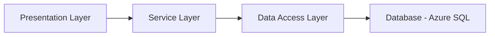

# Todo List Application

The Todo List Application is a simple, yet powerful productivity tool designed to help users create, manage, and track tasks or todo items. It includes collaborative features and provides both web and mobile-based interfaces, providing users the ability to manage their tasks from virtually anywhere.

---

## Features
- **Task Management**: Users can add, edit, and delete tasks easily. 
- **Due Dates and Reminders**: Set due dates for tasks and reminders to ensure they are completed on time. 
- **Categorization**: Tasks can be categorized by project or priority, aiding in task organization.
- **Task Completion**: Users can mark tasks as complete, providing a clear overview of task progress. 
- **Collaboration**: Share tasks with others or assign tasks to team members, enhancing teamwork and task delegation. 
- **Multi-platform**: Access your tasks from anywhere through our mobile and web-based interfaces.

---

## Architecture

The Todo List Application is developed with C# and is deployed on Azure, ensuring high performance and security in line with the principles of the Well Architected Framework (WAF).

The application is divided into several layers:

- **Presentation Layer**: This layer includes our web and mobile user interfaces. It communicates with the service layer to perform application operations.
- **Service Layer**: This layer coordinates the application’s response to user input. It communicates with the data access layer to retrieve or persist data related to a user's tasks.
- **Data Access Layer**: This layer communicates with the Azure SQL Database to store and retrieve task data. It abstracts the underlying database operations from the rest of the application.
- **Database**: Azure SQL Database is used as the database solution. It provides secure, scalable storage for our application data.

---

## Running the Application

Before running the application, ensure that you have the appropriate Azure resources configured and the connection strings set in your configuration file.

To run the application, you can use the `dotnet run` command in the project repository.

---

## Deployment

To deploy the application to Azure, you can use Azure DevOps, GitHub Actions, or any CI/CD platform of your choice. Ensure that your deployment pipeline is properly configured to deploy the application to your Azure resources.

---

## Security

The application follows the security best practices of the Well Architected Framework. This includes using Azure Active Directory for user authentication and role-based access control, and Azure Key Vault for managing application secrets.

---

## Performance and Cost Efficiency

The application is designed to be highly performant and cost-effective, following the principles of the Well Architected Framework. This includes using Azure SQL Database's automatic scaling features to ensure that we only pay for the resources we use, and Azure Cache for improving application performance by caching frequently accessed data.

---

## Contributing

Contributions are welcome! Please read our contributing guide to learn about our development process, how to propose bugfixes and improvements, and how to build and test your changes to the Todo List application.

---

## License

The Todo List Application is licensed under the [MIT license](LICENSE.md).