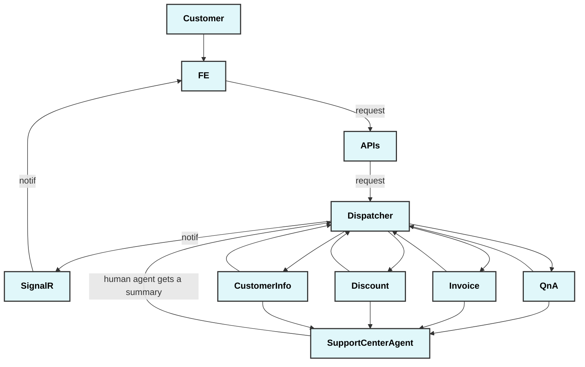

# Support Center application

This is a demo application for a Customer Support Center use case, that showcases the different features of the AI Agent framework.
Acting as the initial point of contact for customers, this agent will autonomously handle generic inquiries and, based on user intent, delegate actions to the appropriate human personnel. The agent will also provide comprehensive summaries and manage all customer interactions.

The agents are designed to be able to interact with each other and the user to achieve their goals.

In the Support Center scenario, several types of agents can be identified based on the tasks and interactions typically seen in customer support scenarios. Here are potential agents for this use case:

### Dispatcher Agent

- **Role**: Orchestrates the overall process, delegates tasks to sub-agents,and ensures seamless customer support.
- **Responsibilities**:
  - Delegate tasks to _sub-agents_ and _human agents_ based on customer intent.
  - Maintain a session state to keep track of customer interactions.
  - Manage event dispatching and responses.

## Sub Agent

#### User Authentication Agent

- **Role**: Handles customer authentication and authorization.
- **Responsibilities**:
  - Validate customer identity based on provided credentials.
  - Handle multi-factor authentication and security checks.

#### QnA Agent

- **Role**: Responds to generic customer queries using an LLM.
- **Responsibilities**:
  - Understand customer queries.
  - Provide accurate and context-aware responses.

#### Customer Info Agent

- **Role**: Updates customer information such as addresses, contact details, etc.
- **Responsibilities**:
  - Validate and update customer information in the database.
  - Notify relevant stakeholders of updates.

#### Invoice Agent

- **Role**: Investigates customer invoice-related issues.
- **Responsibilities**:
  - Analyze customer invoices for discrepancies.
  - Provide explanations or escalate to human agents if necessary.

#### Discount Agent

- **Role**: Handles customer discount requests.
- **Responsibilities**:
  - Apply discounts based on eligibility and company policies.
  - Communicate discount approval or rejection.

## Event Flow and Agent Interactions

The Support Center application is designed to handle customer inquiries and delegate tasks to the appropriate agents. The following is a high-level overview of the event flow and agent interactions in the Support Center application:

**1. Initial Inquiry**

- Customer initiates a session with the Dispatcher Agent.
- Dispatcher Agent identifies the type of inquiry and dispatches to the appropriate sub-agent.

**2. Authentication**

- If customer authentication is required, the Dispatcher Agent dispatches to the User Authentication Agent.
- The User Authentication Agent verifies the customer and reports back.

**3. QnA**

- For generic queries, the Dispatcher Agent delegates to the QnA Agent.
- The QnA Agent responds to the customer based on the inquiry.

**4. Specific Task Handling**

- For specific tasks, the Dispatcher Agent delegates to the relevant sub agent:
  - Customer Info Agent: Reads and Updates customer information.
  - Invoice Agent: Investigates invoice issues.
  - Discount Agent: Handles discount requests.

**5. Human Agent Involvement**

- For complex issues or escalations, the Dispatcher Agent delegate to humana gents.
- Human agents receive comprehensive interaction summaries for context.

**6. Post-Interaction**

- The Dispatcher Agent ensures post-interaction tasks, such as callbacks, are scheduled.
- Summaries and transcripts are saved for future reference.



## Requirements to run locally

### Prerequisites
- **Node.js**: Ensure you have Node.js installed. You can download it from [Node.js official website](https://nodejs.org).
- **.NET SDK**: Ensure you have the .NET SDK installed. You can download it from [Microsoft .NET official website](https://dotnet.microsoft.com/download).
- Visual Studio or Visual Studio code.

### Frontend

1. Navigate to the frontend directory

```
cd ../frontend
```

2. Install Node.js Dependencies

```
npm install
```

3. Set the env variables: check the values in the *.env.localConfig* are correctly set up. In particular, look for the **VITE_OAGENT_BASE_URL** value.

4. Run the frontend selecting the right env file (azure or local). azure option will use the *.env.azureConfig* values, while the local option will use *.env.localConfig*
```
npm run <azure|local>
```

### Backend

1. Navigate to the backend directory

```
cd ../backend
```

2. Restore .NET Dependencies:

```
dotnet restore
```

3. Build and run the backend

```
dotnet build
dotnet run
```

### Application settings

Ensure you have an **appsettings.json** file in the src/backend directory with the following content:

```
{  
  "OpenAIOptions": {  
    "ChatEndpoint": "https://<Your-OpenAI-Endpoint>",  
    "ChatApiKey": "<Your-OpenAI-API-Key>",  
    "ChatDeploymentOrModelId": "<Your-OpenAI-Model-ID>",  
    "EmbeddingsEndpoint": "https://<Your-Embeddings-Endpoint>",  
    "EmbeddingsApiKey": "<Your-Embeddings-API-Key>",  
    "EmbeddingsDeploymentOrModelId": "<Your-Embeddings-Model-ID>"  
  },  
  "QdrantOptions": {  
    "Endpoint": "<Your-Qdrant-Endpoint>",  
    "VectorSize": 1536  
  },  
  "CosmosDbOptions": {  
    "AccountUri": "<Your-CosmosDb-Account-URI>",  
    "AccountKey": "<Your-CosmosDb-Account-Key>",  
    "Containers": [  
      {  
        "DatabaseName": "SupportCenterDB",  
        "ContainerName": "CustomerContainer",  
        "PartitionKey": "/id",  
        "EntityName": "Customer"  
      }  
    ]  
  },  
  "ApplicationInsights": {  
    "ConnectionString": "<Your-Application-Insights-Connection-String>"  
  }
}  
```