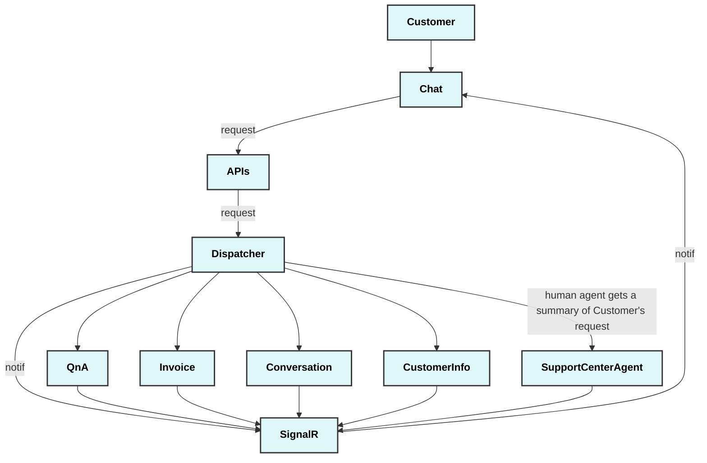
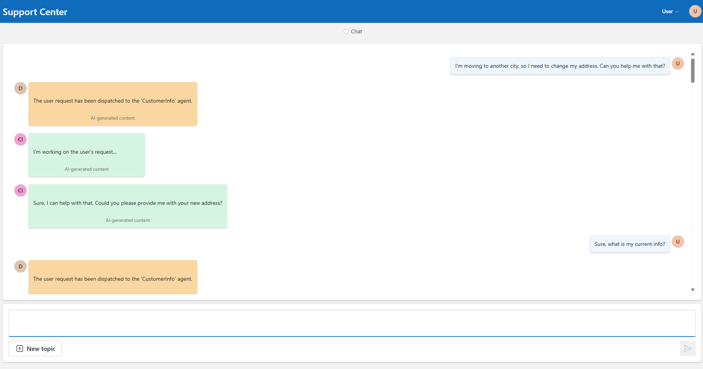

# Support Center application

This is a demo application for a Customer Support Center use case, that showcases the different features of the AI Agent framework.
Acting as the initial point of contact for customers, this agent will autonomously handle generic inquiries and, based on user intent, delegate actions to the appropriate human personnel. The agent will also provide comprehensive summaries and manage all customer interactions.

The agents are designed to be able to interact with each other and the user to achieve their goals.

In the Support Center scenario, several types of agents can be identified based on the tasks and interactions typically seen in customer support scenarios. Here are potential agents for this use case:

### Dispatcher Agent

- **Role**: Orchestrates the overall process, delegates tasks to sub-agents,and ensures seamless customer support.
- **Responsibilities**:
  - Delegate tasks to _sub-agents_ and _human agents_ based on customer intent.
  - Maintain a session state to keep track of customer interactions.
  - Manage event dispatching and responses.

## Sub Agent

#### User Authentication Agent - out of scope

- **Role**: Handles customer authentication and authorization.
- **Responsibilities**:
  - Validate customer identity based on provided credentials.
  - Handle multi-factor authentication and security checks.

#### QnA Agent

- **Role**: Responds to generic customer queries using an LLM grounded with data.
- **Responsibilities**:
  - Understand customer queries.
  - Provide accurate and context-aware responses.

#### Customer Info Agent

- **Role**: Updates customer information such as addresses, contact details, etc.
- **Responsibilities**:
  - Validate and update customer information in the database.
  - Notify relevant stakeholders of updates.

#### Invoice Agent

- **Role**: Investigates customer invoice-related issues.
- **Responsibilities**:
  - Analyze customer invoices for discrepancies.
  - Provide explanations or escalate to human agents if necessary.

#### Conversation Agent

- **Role**: Handles customer generic conversations.
- **Responsibilities**:
  - Be polite and guide the conversation.

## Event Flow and Agent Interactions

The Support Center application is designed to handle customer inquiries and delegate tasks to the appropriate agents. The following is a high-level overview of the event flow and agent interactions in the Support Center application:

**1. Initial Inquiry**

- Customer initiates a session with the Support Center team. Their first interaction is with a Dispatcher Agent
- Dispatcher Agent identifies the type of inquiry and dispatches to the appropriate sub-agent.

**2. Conversation**

- If customer is having a generic conversation, the Dispatcher Agent dispatches to the Conversation Agent.

**3. QnA**

- For generic internal queries, the Dispatcher Agent delegates to the QnA Agent.
- The QnA Agent has the knowledge based on different documents that has been seeded (and vectorised) into a Qdrant database.
- The QnA Agent responds to the customer based on the inquiry following the RAG pattern.

**4. Invoice**

- For questions about invoices, the Dispatcher Agent delegates to the Invoice Agent.
- The Invoice Agent has the knowledge based on different invoices that has been processed by Azure Document Intelligence to extract fields in the invoices and seeded (and vectorised) into Azure AI Search.
- The Invoice Agent responds to the customer based on the inquiry following the RAG pattern.

**5. Specific Task Handling**

- For specific tasks, the Dispatcher Agent delegates to the relevant sub agent:
  - Customer Info Agent: Reads and Updates customer information.
  - Invoice Agent: Investigates invoice issues.
  - QnA Agent: Handles internal knowledge requests.
  - Conversation Agent: Handles generic conversations.

**6. Post-Interaction**

- The Dispatcher Agent ensures post-interaction tasks, such as callbacks, are scheduled.
- Summaries and transcripts are saved for future reference.


## Example Flow Description



The screenshot depicts a conversation flow between a user (customer) and the AI agent in the Support Center application.
Here is a step-by-step description of the flow:
1. **User Initiation**:
The user initiates the conversation by stating: *"I'm moving to another city, so I need to change my address. Can you help me with that?"*
This message is sent to the frontend, which then forwards it to the backend API.
2. **Dispatcher Agent Handling**:
The backend API receives the user's request and forwards it to the Dispatcher Agent.
The Dispatcher Agent analyzes the intent of the user's message and determines that the request is related to updating customer information.
The Dispatcher Agent delegates the task to the Customer Info Agent.
3. **Customer Info Agent Request**:
The Customer Info Agent processes the request and responds with: *"Could you please provide your new address? I need this information to update your records."*
This response is sent back to the frontend via SignalR, and the frontend displays the message to the user.
4. **User Response**:
The user provides their new address by saying: *"Sure here it is: caramba23"*.
This message is sent to the frontend, which then forwards it to the backend API.
5. **Dispatcher Agent Clarification**:
The backend API receives the user's new address and forwards it to the Dispatcher Agent.
The Dispatcher Agent determines that further clarification is needed and delegates the task to the Customer Info Agent.
The Customer Info Agent responds with: *"Could you please clarify what you want to do with the provided information 'caramba23'? Do you want to update any information or retrieve data related to this?"*
This response is sent back to the frontend via SignalR, and the frontend displays the message to the user.
6. **User Confirmation**:
The user confirms their intention by saying: *"my new address is caramba23"*.
This message is sent to the frontend, which then forwards it to the backend API.
7. **Customer Info Agent Update**:
The backend API receives the user's confirmation and forwards it to the Customer Info Agent.
The Customer Info Agent processes the update and responds with: *"Your address has been successfully updated to 'caramba23'."*
This response is sent back to the frontend via SignalR, and the frontend displays the message to the user.

## Requirements to run locally

### Prerequisites
- **Node.js**: Ensure you have Node.js installed. You can download it from [Node.js official website](https://nodejs.org).
- **.NET SDK**: Ensure you have the .NET SDK installed. You can download it from [Microsoft .NET official website](https://dotnet.microsoft.com/download).
- Visual Studio or Visual Studio code.

### Frontend

1. Navigate to the frontend directory

```
cd ../frontend
```

2. Install Node.js Dependencies

```
npm install
```

3. Set the env variables: check the values in the *.env.localConfig* are correctly set up. In particular, look for the **VITE_OAGENT_BASE_URL** value.

4. Run the frontend selecting the right env file (azure or local). azure option will use the *.env.azureConfig* values, while the local option will use *.env.localConfig*
```
npm run <azure|local>
```

### Backend

1. Navigate to the backend directory

```
cd ../backend
```

2. Restore .NET Dependencies:

```
dotnet restore
```

3. Build and run the backend

```
dotnet build
dotnet run
```

### Application settings

Ensure you have an **appsettings.json** file in the src/backend directory with the following content:

```
{  
  "OpenAIOptions": {  
    "ChatEndpoint": "https://<Your-OpenAI-Endpoint>",  
    "ChatApiKey": "<Your-OpenAI-API-Key>",  
    "ChatDeploymentOrModelId": "<Your-OpenAI-Model-ID>",  
    "EmbeddingsEndpoint": "https://<Your-Embeddings-Endpoint>",  
    "EmbeddingsApiKey": "<Your-Embeddings-API-Key>",  
    "EmbeddingsDeploymentOrModelId": "<Your-Embeddings-Model-ID>"  
  },  
  "QdrantOptions": {  
    "Endpoint": "<Your-Qdrant-Endpoint>",  
    "VectorSize": 1536  
  },  
  "CosmosDbOptions": {  
    "AccountUri": "<Your-CosmosDb-Account-URI>",  
    "AccountKey": "<Your-CosmosDb-Account-Key>",  
    "Containers": [  
      {  
        "DatabaseName": "SupportCenterDB",  
        "ContainerName": "CustomerContainer",  
        "PartitionKey": "/id",  
        "EntityName": "Customer"  
      }  
    ]  
  },  
  "ApplicationInsights": {  
    "ConnectionString": "<Your-Application-Insights-Connection-String>"  
    },   
  "AISearchOptions": {
    "SearchEndpoint": "<mandatory>",
    "SearchKey": "<mandatory>",
    "SearchIndex": "<mandatory>",
    "SearchEmbeddingDeploymentOrModelId": "text-embedding-ada-002",
    "SearchEmbeddingEndpoint": "https://<mandatory>.openai.azure.com/",
    "SearchEmbeddingApiKey": "<mandatory>"
  }
} 
```
Note! SignalR requires a https endpoint.

## Seed memory for Invoice agent
For now one single invoice is configured in the Program.cs.
Provision Azure Document Intelligence and Azure AI Search instances. If you provisioned all servies through azd up earlier, these services do already exist. You have the appsetting.template.json to quickstart. Save a copy of appsetting.template.json to a file called appsetting.json and fill in the correct values found in the Azure portal.
Run seed-invoice-memory project with dotnet run to extract the invoice fields with Document intelligence pre-built invoice model and store the information in AI Search.

## Seed memory for QnA agent
For now the knowledge is based on the example files located in the seed-memory folder.

Run locally:
Download and run Qdrant locally ( docker run -p 6333:6333 qdrant/qdrant).
Make sure you have the correct values set in config/appsetting.json.

OR run in Azure:
Provision Qdrant. If you provisioned all servies through azd up earlier, the service does already exist and has been deployed to Azure Container Apps. You have the appsetting.template.json to quickstart. Save a copy of appsetting.template.json to a file called appsetting.json and fill in the correct values found in the Azure portal.

Run seed-memory project with dotnet run to load the collection vfcon106047 with the data.
