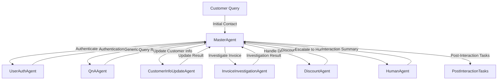

# [In progress] Support Center application

This is a demo application for a Customer Support Center use case, that showcase the different features of the AI Agent framework.
Acting as the initial point of contact for customers, this agent will autonomously handle generic inquiries and, based on user intent, delegate actions to the appropriate human personnel. The agent will also provide comprehensive summaries and manage all customer interactions.

The agents are designed to be able to interact with each other and the user to achieve their goals.

In the Support Center scenario, several types of agents can be identified based on the tasks and interactions typically seen in customer support scenarios. Here are potential agents for this use case:

### Master Agent
- **Role**: Orchestrates the overall process, delegates tasks to sub-agents,and ensures seamless customer support.
- **Responsibilities**:
	- Delegate tasks to *sub-agents* and *human agents* based on customerintent.
	- Maintain a session state to keep track of customer interactions.
	- Manage event dispatching and responses.

### Sub Agent
#### User Authentication Agent
- **Role**: Handles customer authentication and authorization.
- **Responsibilities**:
	- Validate customer identity based on provided credentials.
	- Handle multi-factor authentication and security checks.
#### QnA Agent
- **Role**: Responds to generic customer queries using an LLM.
- **Responsibilities**:
	- Understand customer queries.
	- Provide accurate and context-aware responses.
#### Customer Info Update Agent
- **Role**: Updates customer information such as addresses, contact details, etc.
- **Responsibilities**:
	- Validate and update customer information in the database.
	- Notify relevant stakeholders of updates.
#### Invoice Investigation Agent
- **Role**: Investigates customer invoice-related issues.
- **Responsibilities**:	
	- Analyze customer invoices for discrepancies.
	- Provide explanations or escalate to human agents if necessary.
#### Discount Agent
- **Role**: Handles customer discount requests.
- **Responsibilities**:
	- Apply discounts based on eligibility and company policies.
	- Communicate discount approval or rejection.

## Event Flow and Agent Interactions
The Support Center application is designed to handle customer inquiries and delegate tasks to the appropriate agents. The following is a high-level overview of the event flow and agent interactions in the Support Center application:

**1. Initial Inquiry** 
	- Customer initiates a session with the Master Agent.
	- Master Agent identifies the type of inquiry and dispatches to the appropriate sub-agent.
**2. Authentication**
	- If customer authentication is required, the Master Agent dispatches to the User Authentication Agent.
	- The User Authentication Agent verifies the customer and reports back.
**3. QnA**
	- For generic queries, the Master Agent delegates to the QnA Agent.
	- The QnA Agent responds to the customer based on the inquiry.
**4. Specific Task Handling**
	- For specific tasks, the Master Agent delegates to the relevant sub agent:
		- Customer Info Update Agent: Updates customer information.
		- Invoice Investigation Agent: Investigates invoice issues.
		- Discount Agent: Handles discount requests.
**5. Human Agent Involvement**
	- For complex issues or escalations, the Master Agent delegate to humana gents.
	- Human agents receive comprehensive interaction summaries for context.
**6. Post-Interaction**
	- The Master Agent ensures post-interaction tasks, such as callbacks, are scheduled.
	- Summaries and transcripts are saved for future reference.




## Requirements to run locally
### Frontend
The latest version of Node.js and npm

### Backend
Visual Studio or Visual Studio code and the latest version of dotnet

## Running with azd
To run the application with azd, you need to have the azd cli installed. You can install it following the instructions here:

https://learn.microsoft.com/en-us/azure/developer/azure-developer-cli/install-azd?tabs=winget-windows%2Cbrew-mac%2Cscript-linux


Then you can run the following command to start the application:
```powers

## How to run the application locally

Execute Run.ps1. IF you are missing the config file the script will create an empty one for you and ask you to fill it out.
```
.\run.ps1 
```

## How to debug the application locally
To debug the backend, you can simply open the solution in Visual Studio, and press F5 to start debugging.
Remember to copy `appsettings.local.template.json` to `appsettings.json` and fill out the values.</p>
The frontend is a NodeJS React application. You can debug it using Visual Studio code.